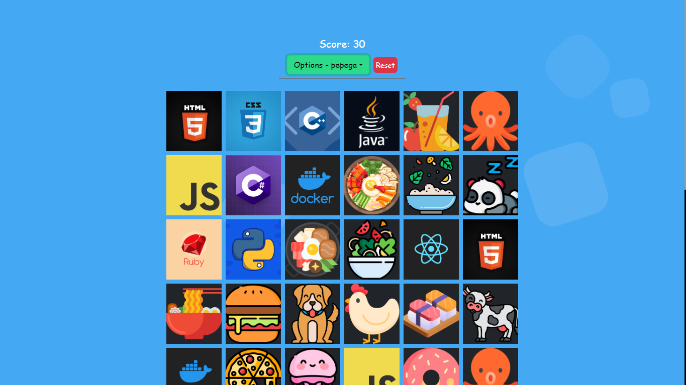

# Memory Game

Demo [memory-game](https://xvpc.github.io/memory-game/)

## Technologies
- HTML/CSS/JAVASCRIPT
- BOOTSTRAP/SASS
- REACTJS/NEXTJS

## Screenshot

# Icons
I got Most of the Icon and Images From 
[flaticon.com](https://www.flaticon.com/)

Background is From 
[wweb.dev](https://wweb.dev/resources/animated-css-background-generator)

